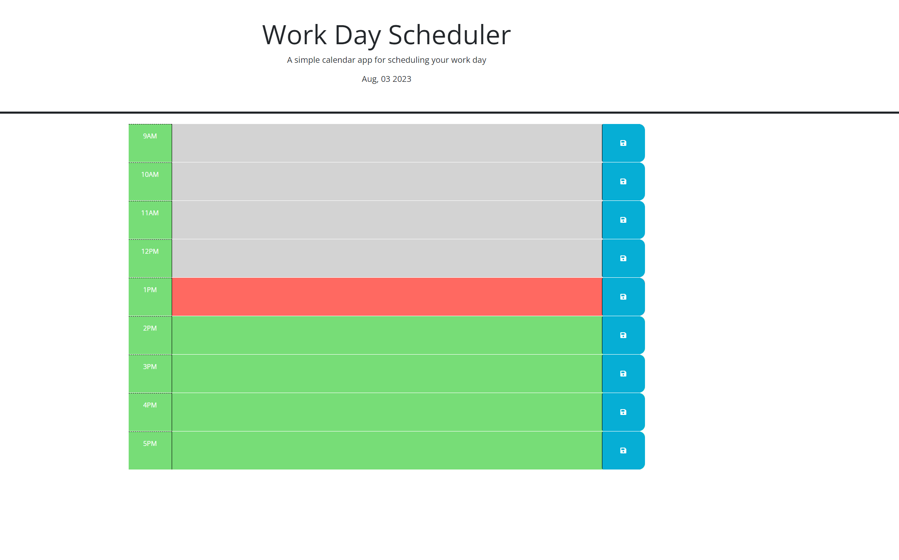

# Planner

## Description

This is my planner site. This site gives the user time blocks from 9am to 5pm, where they can input tasks they want to accomplish. It features a date at the top, which updates everyday by using dayjs, and the text areas change color depending on if that hour block is in the past, is the current hour, or is in the future.  When the user puts text into a given text area and hits the save button for that area, their text is saved to local storage. On refreshing or reopening the page, the text areas are populated with the values saved in local storage. 

[This is a link to the deployed site!](https://danmac121.github.io/Planner/)
